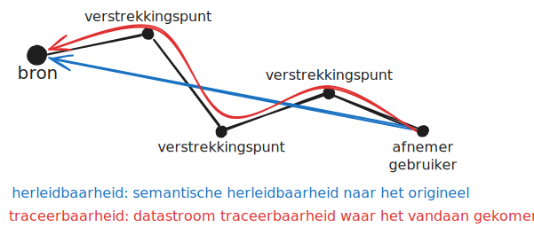
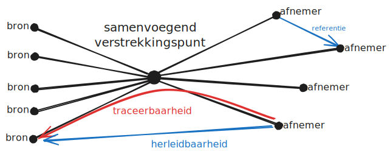

# FDS Landelijke Voorziening

Uitwerking van casuïtiek, patronen, voorwaarden en aspecten... rondom **~~landelijke
voorzieningen~~** (LVs) of misschien beter: **samenvoegend verstrekkingspunt**.

Verschillende variaties:

- Casus LV-WOZ
- ...? (welke casussen nog meer?)
- [Patroon verstrekkingspunt cumulatie gelijkvormige
  bronnen](./doc/patroon-verstrekkingspunt-cumulatie-gelijkvormige-bronnen.md)
- [Patroon verstrekkingspunt consolidatie gelijkvormige
  bronnen](./doc/patroon-verstrekkingspunt-consolidatie-gelijkvormige-bronnen.md)
- Patroon verstrekkingspunt gelijkvormige selectie uit vergelijkbare bronnen
- [Toetsing criteria](./doc/toetsing-criteria.md)
- ...? (welke variaties hebben we nog meer?)

Per variatie werken we uit:

- 1 Markdown file in `/doc` folder
  - filename conventies
    - lower case en hyphens (`-`)
    - `casus-lv-<naam>.md` of `patroon-<naam>.md`
- Daarin staat volgens template:
  - Naam
  - Beschrijving (uitgebreide toelichting)
  - Sterke punten
  - Zwakke punten
  - Overwegingen
- Begeleidende plaatjes
  - in [Excalidraw](https://excalidraw.com/) of [draw.io](https://app.diagrams.net/)
  - filename conventie: `casus-lv-<naam>-<naam-plaatje>.excalidraw.svg`
  - filename conventie: `patroon-<naam>-<naam-plaatje>.excalidraw.svg`

## Definities

- **registratie** : Een gegevensverzameling waarin gegevens worden vastgelegd
  ([bron](https://www.noraonline.nl/wiki/Begrip:Id-577b609e-9b4d-25b9-9ce8-111249f52862))
- **bron**: Een registratie die is *aangewezen* als de plaats waarin gegevens worden *beheerd*
  ([bron](https://www.noraonline.nl/wiki/Begrip:Id-1c429ce5-3b82-4345-6ead-43c8d65f120d))
- **verstrekkingspunt** : Een gegevensdienst die is *aangewezen* om gebruikt te worden om bepaalde
  soorten gegevens te verkrijgen
  ([bron](https://www.noraonline.nl/wiki/Begrip:Id-6ed15269-8079-6b81-8f7d-2f6a1cae488d))

## Herleidbaarheid en traceerbaarheid



**Herleidbaarheid** gaat over de [data
lineage](https://www.noraonline.nl/wiki/Handreiking_Datalineage), de semantische herleidbaarheid
naar het *origineel*, daar waar de informatie oorspronkelijk is vastgelegd, in de *bron*.

**Traceerbaarheid** gaat over de navolgbaarheid waar de informatie (data) vandaan is gekomen, van
welk verstrekkingspunt en welke route het heeft afgelegd.

## Landelijke voorziening

Een **landelijke voorziening** is een _samenvoegend verstrekkingspunt_ dat is aangewezen als
ontsluiting van meerdere bronnen. Afnemers kunnen op deze manier landelijke datasets bevragen en
gebruiken zonder zelf alle bronnen afzonderlijk te bevragen. Bovendien wordt in een landelijke
voorziening consolidatie toegepast om conflicterende situaties voor afnemers op te lossen. Dit het
[patroon verstrekkingspunt consolidatie gelijkvormige
bronnen](./doc/patroon-verstrekkingspunt-consolidatie-gelijkvormige-bronnen.md). Deze
oplossingsrichting draagt bij aan minder **estafette** en dus meer traceerbaarheid en
herleidbaarheid naar de bron (van oorsprong) heeft extra aandacht genoten evenals historie.



## Resources

Inspiratie en referentie bronnen die gebruikt zijn:

- [federatief.datastelsel.nl | Data deel concept](https://federatief.datastelsel.nl/kennisbank/datadeelconcept/)
- [NORA Online | Begrippen Domeinarchitectuur Gegevensuitwisseling](https://www.noraonline.nl/wiki/Begrippen_Domeinarchitectuur_Gegevensuitwisseling)

## Contributie

We werken voornamelijk met Markdown files en plaatjes ... waarbij de plaatjes
[excalidraw](https://excalidraw.com/) plaatjes kunnen zijn (waarvoor ook een [VS Code
plugin](https://marketplace.visualstudio.com/items?itemName=pomdtr.excalidraw-editor)) voor
beschikbaar is.

Voor presentaties maken we gebruik van [Marp](https://marp.app/).

Line breaks op 120 en zie [.editorconfig](./.editorconfig).

## Development

Lokaal kan mbv [asdf](https://asdf-vm.com/) gebruik gemaakt worden van command line tools:

```bash
asdf install
```

## Formalities

This repo is licensed under [EUPL v1.2](LICENSE).
